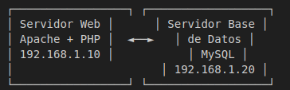

# AP - Treball amb git i desplegament de codi inicial

## Índice

1. [Conexión con GitHub](conexión_git.md)
2. [Configuración del Servidor Apache con PHP](s.apache-php.md)
3. [Configuración del Servidor MySQL](s.sql.md)

## Arquitectura Desplegada

Hemos desplegado una arquitectura de dos servidores:

- **Servidor Web**: Apache con PHP
- **Servidor de Base de Datos**: MySQL

Los servidores se comunican entre sí a través de la red. El servidor web aloja la aplicación PHP que se conecta al servidor de base de datos.

## Proceso General

1. **Preparación del repositorio GitHub**: Creación del repositorio y configuración de accesos.
2. **Configuración de los servidores**:
   - Servidor Apache/PHP: Instalación y configuración de Apache, PHP y extensión MySQL.
   - Servidor MySQL: Instalación y configuración de MySQL, creación de base de datos y usuario.
3. **Clonación del código** en ambos servidores.
4. **Corrección de bugs** en el código.
5. **Despliegue y pruebas**.

## Correciones en el código

### Código Apache/PHP

### Base de datos

  

